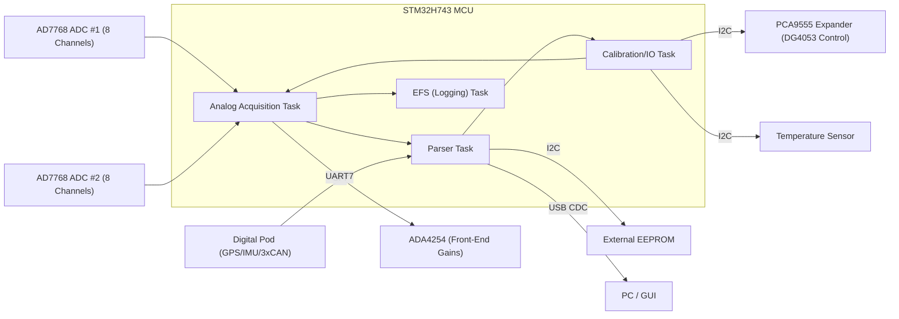
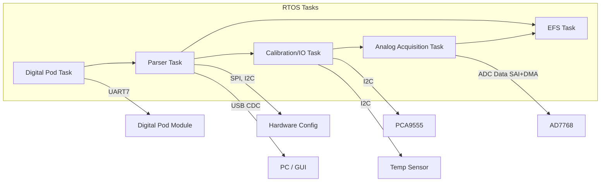
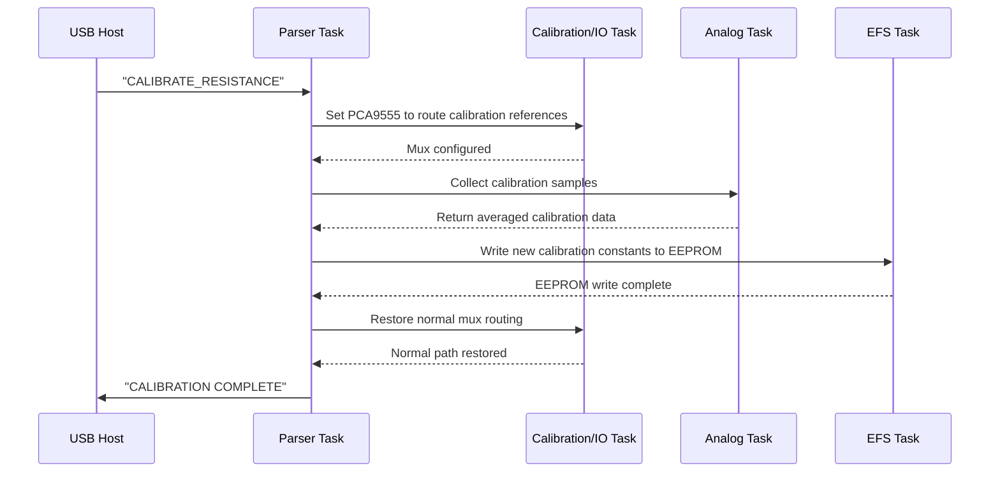
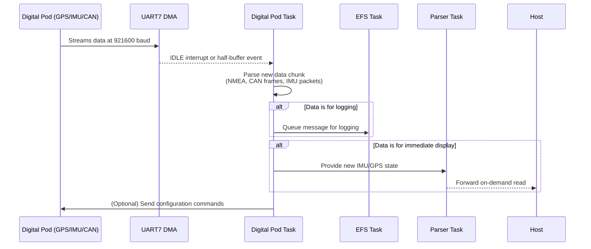

Below is the updated document formatted as a GitHub Markdown file with Mermaid diagrams:

---

# Data Acquisition Firmware Architecture

**Firmware for 16-Channel Data Acquisition using STM32H743VIT6**

---

## 1. Introduction

This document describes the firmware architecture for a high-performance data acquisition system based on the **STM32H743VIT6** microcontroller. The system supports:

- **16 Analog Channels** via two **AD7768** 8-channel ADCs.
- Programmable instrumentation amplifiers (**ADA4254**) for front-end gain.
- A **Calibration Multiplexer** (**DG4053**) controlled via an **I/O Expander** (**PCA9555**) to route precision references.
- An **External EEPROM** for storing calibration data and system settings.
- A **Temperature Sensor** for cold-junction compensation of thermocouples.
- A “Digital Pod” module (GPS, IMU, and 3× CAN) communicating via **UART7**.
- Communication interfaces: **I2C, SPI, UART, SAI, USB**.
- Real-time tasks under an RTOS (e.g., FreeRTOS) for concurrent operation.

---

## 2. High-Level System Architecture

### 2.1 Block Diagram

**Legend:**

- **Analog Acquisition Task**: Continuously reads ADC samples via SAI + DMA.
- **Parser Task**: Handles commands from the USB Virtual COM port.
- **Calibration/IO Task**: Manages the I/O expander and I2C sensors.
- **EFS (Logging) Task**: Logs data to external storage.
- **Digital Pod**: Sends combined digital sensor data (GPS/IMU/CAN) via UART7.

---

## 3. Tasks and Responsibilities

| **Task Name**             | **Responsibility**                                                                                                           | **Priority**        |
|---------------------------|-------------------------------------------------------------------------------------------------------------------------------|---------------------|
| **Analog Acquisition**    | Reads raw samples from AD7768 via SAI+DMA, converts them, applies calibration, and queues data for logging.                   | High (Real-Time)    |
| **Calibration/IO**        | Controls the calibration mux via PCA9555, manages I2C sensor reads (temperature), and other digital I/O tasks.                 | Medium              |
| **Parser**                | Processes USB-CDC commands, configures system parameters, and sends responses.                                               | Above Normal        |
| **EFS (Logging)**         | Writes data to external storage (EEPROM/Flash/SD) and persists calibration coefficients.                                     | Medium-High         |
| **Digital Pod**           | Processes UART7 data from the digital pod (GPS, IMU, CAN), parses messages, and updates system state or queues data for logging.| High (to avoid data loss) |
| **Idle/Housekeeping**     | Handles background tasks and CPU power management.                                                                          | Low                 |

---

## 4. Detailed Architecture and Data Flow

### 4.1 Analog Signal Path

1. **ADA4254 Instrumentation Amps**  
   - Provide programmable gain/offset for each channel.
   - Configured via **SPI**.

2. **AD7768 ADCs**  
   - Two devices, each with 8 channels.
   - Output time-division-multiplexed data via **SAI**.
   - **DMA** captures samples into a circular buffer.

3. **Analog Acquisition Task**  
   - Processes the DMA buffer upon half/full-completion interrupts.
   - Applies calibration constants and shares data for logging or USB readout.

---

### 4.2 Calibration Multiplexer and I/O Expander

- **DG4053** routes either sensor signals or calibration references into ADC inputs.
- **PCA9555** (via I2C) controls the DG4053.
- During calibration, known references are injected for offset/gain calculation.
- New calibration constants are stored in **EEPROM**.

---

### 4.3 Temperature Sensor (Cold-Junction)

- Reads temperature for cold-junction compensation.
- Accessed via I2C and read periodically by the **Calibration/IO Task** (or dedicated task).
- Data is used by the Analog Acquisition Task to adjust thermocouple readings.

---

### 4.4 Digital Pod Communication

- An external module streams **GPS**, **IMU**, and **CAN** data via **UART7** at **921600 baud**.
- **Digital Pod Task** uses **DMA** to capture UART data into a ring buffer, then parses the messages.
- Parsed messages are forwarded for logging or immediate display.

---

### 4.5 USB Parser and Command Handling

- The STM32 enumerates as a **USB CDC (Virtual COM Port)** device.
- **Parser Task** reads commands from the host and directs other tasks (e.g., start calibration, set gain).
- Responses and status updates are sent back via USB.

---

## 5. Flow Diagrams

### 5.1 High-Level Task Interaction

### 5.2 Calibration Sequence Example

### 5.3 Digital Pod Data Flow

---

## 6. Peripheral and Buffer Configuration

### 6.1 Peripheral Configuration Summary

| **Peripheral**          | **Interface**             | **Configuration**                                        | **Used By**                       |
|-------------------------|---------------------------|----------------------------------------------------------|-----------------------------------|
| **AD7768 (×2)**         | SAI (Slave) + SPI (cfg)   | 16-ch TDM, ~192 kSPS/ch, 24-bit; SPI for register config   | Analog Acquisition Task           |
| **ADA4254 (×16)**       | SPI (Master)              | Configured gain/offset via SPI commands                  | Parser Task (via commands)        |
| **DG4053 Cal Mux**      | PCA9555 (I2C) outputs     | 3x SPDT switches for calibration references              | Calibration/IO Task               |
| **PCA9555 Expander**    | I2C (100 kHz)             | 16 GPIOs for mux control and additional I/O              | Calibration/IO Task               |
| **Temperature Sensor**  | I2C (100 kHz)             | Cold-junction temperature sensor                         | Calibration/IO Task               |
| **EEPROM**              | I2C (100 kHz)             | Stores calibration & config data                         | EFS Task                         |
| **Digital Pod**         | UART7 (921600 baud)       | Multiplexed GPS/IMU/3xCAN data                             | Digital Pod Task                  |
| **USB (CDC)**           | USB FS Device             | Virtual COM port for commands & responses                | Parser Task                       |

---

### 6.2 Buffer and Queue Allocations

| **Buffer**               | **Size**                                | **Purpose**                                             | **Managed By**                    |
|--------------------------|-----------------------------------------|---------------------------------------------------------|-----------------------------------|
| **ADC DMA Buffer**       | Double-buffer (e.g., 2×512 samples × 16 channels) | Holds raw ADC data (SAI + DMA)                         | DMA writes; Analog Task reads     |
| **Calibration Buffer**   | ~100 samples per channel                | Temporary storage for calibration measurements          | Analog Task (during calibration)  |
| **UART7 RX Ring Buffer** | ~1024 bytes (DMA)                       | Accumulates digital pod data before parsing             | Digital Pod Task                  |
| **Parsed Pod Messages**  | Queue of ~50 items (each 16–64 bytes)     | Holds parsed CAN frames/GPS lines for logging/usage     | Digital Pod Task → EFS Task       |
| **USB CDC RX**           | 64-byte packet buffer                   | Incoming USB command data                               | Parser Task                       |
| **USB CDC TX**           | 64-byte (or ring) buffer                | Outgoing responses to host                              | Parser Task                       |
| **EEPROM Write Buffer**  | ~32–64 bytes                            | Staging block for writing calibration/config data       | EFS Task                          |

---

## 7. Example Workflows

### 7.1 Startup

- **RTOS** initializes all tasks.
- **Parser Task** sets default gains for ADA4254 amps.
- **Analog Task** configures AD7768 registers via SPI and starts DMA capture on SAI.
- **Digital Pod Task** initializes UART7 and begins data reception.
- System enters steady-state data acquisition.

### 7.2 Calibration

- **User** sends a “CALIBRATE_VOLTAGE” command over USB.
- **Parser Task** instructs **Calibration/IO Task** to set the PCA9555 for calibration.
- **Analog Task** collects calibration samples and computes calibration constants.
- **EFS Task** writes new calibration data to EEPROM.
- **Calibration/IO Task** restores normal mux routing.
- **Parser Task** confirms calibration completion to the host.

### 7.3 Logging

- **User** sends “START_LOG” command.
- **Parser Task** signals **EFS Task** to open a new log file.
- **Analog Task** and **Digital Pod Task** continuously queue data for logging.
- **EFS Task** writes data to external storage.
- “STOP_LOG” command finalizes logging and flushes buffers.

---

## 8. Conclusion

This document provides a structured overview of the firmware design, detailing how each task, peripheral, and communication interface operates to achieve high-speed, multi-channel data acquisition with calibration, logging, and external sensor integration. The use of **Mermaid diagrams** and detailed tables offers a clear, visual reference for developers and maintainers, ensuring the system can be efficiently understood, maintained, and extended.

---

Feel free to adjust any sections or parameters based on further design details or changes in your firmware implementation.
